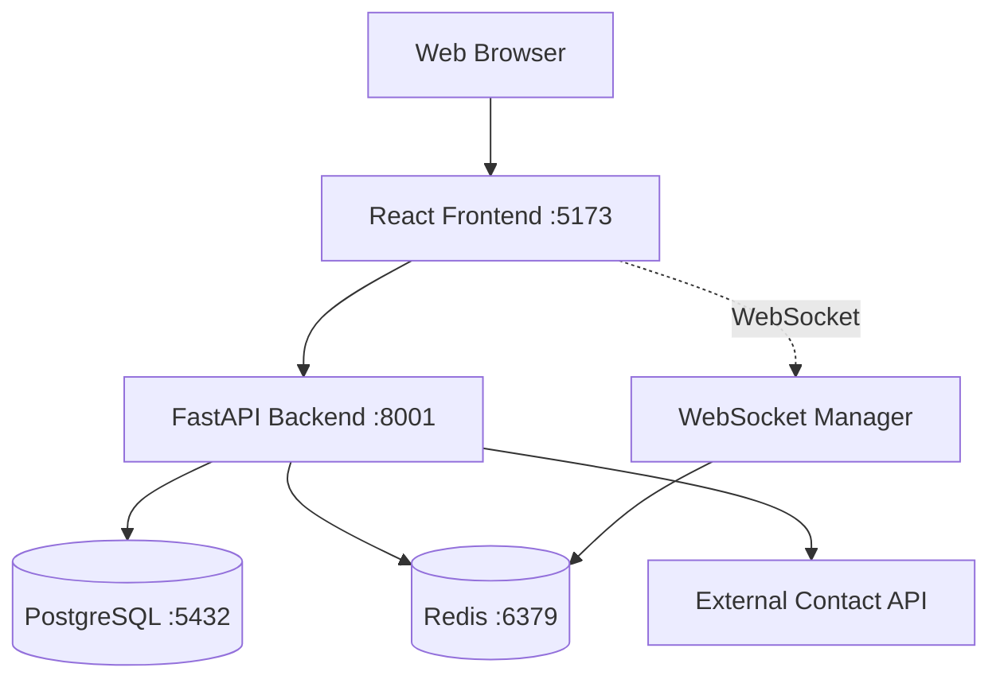

<div align="center">

# 🐦 ChirpChat

### Modern Microblogging Platform with Intelligent Complaint Management

[](https://github.com/Archimed-Anderson/ChirpChat)
[](LICENSE)
[](https://www.docker.com/)
[](https://fastapi.tiangolo.com/)
[](https://react.dev/)

[Features](#-features) • [Quick Start](#-quick-start) • [Documentation](#-api-documentation) • [Tech Stack](#-tech-stack) • [Contributing](#-development)

</div>

---

## 📖 Overview

**ChirpChat** is a next-generation microblogging platform that combines the familiar social media experience with an innovative complaint management system. Built with modern web technologies and enterprise-grade architecture, ChirpChat enables users to share thoughts, engage with content, and seamlessly report issues through auto-generated contact forms.

### Why ChirpChat?

- 🚀 **Lightning Fast**: Built with React + Vite for instant page loads and smooth interactions
- 🔒 **Secure by Design**: JWT authentication, password hashing, and comprehensive security measures
- 📱 **Real-time Experience**: WebSocket-powered live updates for instant content delivery
- 🐳 **Developer Friendly**: Fully containerized with one-command deployment
- 🎯 **Smart Complaint System**: Unique UUID-based complaint tracking with external API integration
- 📊 **Production Ready**: Structured logging, health checks, and monitoring built-in

## ✨ Features

### Core Functionality

| Feature | Description |
|---------|-------------|
| 💬 **Microblogging** | Share thoughts in 500-character "chirps" with a Twitter-inspired interface |
| 📢 **Complaint Management** | Create special complaint posts with auto-generated unique tracking links |
| 📝 **Dynamic Forms** | Each complaint generates a unique UUID-based URL with contact form |
| 🔌 **API Integration** | Seamless forwarding of complaint data to external contact APIs |
| ⚡ **Real-time Updates** | WebSocket-powered live timeline for instant content delivery |
| 🔐 **Secure Authentication** | JWT-based auth with access/refresh token management |
| 👥 **Social Interactions** | Like, comment, and engage with posts |
| 🎨 **Modern UI/UX** | Responsive, clean design inspired by modern social platforms |
| 📊 **Structured Logging** | JSON-formatted logs for monitoring and debugging |
| 🐳 **Full Containerization** | Docker Compose orchestration for one-command deployment |

### Technical Highlights

- **Multi-stage Docker builds** for optimized production images
- **SQLAlchemy ORM** with PostgreSQL for robust data management
- **Redis pub/sub** for WebSocket message broadcasting
- **Pydantic validation** for type-safe API contracts
- **React Router** for seamless client-side navigation
- **Zustand** for lightweight, performant state management
- **Comprehensive error handling** with custom error boundaries

## 📋 Table of Contents

- [Overview](#-overview)
- [Features](#-features)
- [Quick Start](#-quick-start)
- [Architecture](#-architecture)
- [Tech Stack](#-tech-stack)
- [Installation](#-installation)
- [Configuration](#-configuration)
- [API Documentation](#-api-documentation)
- [Testing](#-testing)
- [Project Structure](#-project-structure)
- [Development](#-development)
- [Troubleshooting](#-troubleshooting)
- [Contributing](#-contributing)
- [License](#-license)

## 🚀 Quick Start

### Prerequisites

Before you begin, ensure you have the following installed:

- **Docker Desktop** (v20.10+) with Docker Compose
- **Git** (v2.30+)
- **Node.js** (v20+) - only for local development
- **Python** (v3.11+) - only for local development

### 🎯 Get Started in 3 Steps

#### 1️⃣ Clone the Repository

```bash
git clone https://github.com/Archimed-Anderson/ChirpChat.git
cd ChirpChat
```

#### 2️⃣ Configure Environment (Optional)

```bash
# Copy the example environment file
cp .env.example .env

# Edit configuration as needed
# Recommended: Change SECRET_KEY and database passwords
```

#### 3️⃣ Launch the Application

**Windows:**
```powershell
.\dev.bat up
```

**Linux/macOS:**
```bash
chmod +x dev
./dev up
```

### 🌐 Access Points

Once running, access the application at:

| Service | URL | Description |
|---------|-----|-------------|
| 🎨 **Frontend** | http://localhost:5173 | Main application UI |
| 🔧 **Backend API** | http://localhost:8001 | REST API endpoints |
| 📚 **API Docs (Swagger)** | http://localhost:8001/docs | Interactive API documentation |
| 📖 **API Docs (ReDoc)** | http://localhost:8001/redoc | Alternative API documentation |

### 🎭 Demo Mode

**Seed sample data** (optional but recommended for testing):

```bash
# Windows
.\dev.bat seed

# Linux/macOS
./dev seed
```

**Login with demo credentials:**
- **Username**: `jeanmartin0` (or any user from seed data)
- **Password**: `password123`

> 💡 **Tip**: Check the logs to see all seeded usernames: `./dev logs backend`

## 🏗️ Architecture

ChirpChat follows a modern **containerized microservices architecture** with clear separation of concerns:



### 🔧 System Components

#### Frontend Layer
- **React 18** with TypeScript for type safety
- **Vite** as build tool for lightning-fast HMR
- **Zustand** for predictable state management
- **React Router** for SPA navigation
- **WebSocket client** for real-time updates

#### Backend Layer
- **FastAPI** (Python 3.11) for high-performance async API
- **SQLAlchemy** ORM for database abstraction
- **Pydantic** for request/response validation
- **JWT** (python-jose) for secure authentication
- **HTTPX** for async external API calls

#### Data Layer
- **PostgreSQL 15** for relational data persistence
- **Redis 7** for WebSocket pub/sub messaging
- **Structured JSON logs** stored in `/app/logs`

#### Infrastructure
- **Docker Compose** for service orchestration
- **Multi-stage Dockerfiles** for optimized images
- **Health checks** for service monitoring
- **Volume mounts** for development hot-reload

## 🛠️ Tech Stack

<div align="center">

### Backend Technologies

| Technology | Version | Purpose |
|-----------|---------|----------|
|  | 0.104+ | High-performance async web framework |
|  | 3.11 | Core programming language |
|  | 2.0+ | ORM for database operations |
|  | 2.0+ | Data validation and settings |
|  | Latest | ASGI server |
| **Python-JOSE** | Latest | JWT token encoding/decoding |
| **Passlib** | Latest | Password hashing with bcrypt |
| **HTTPX** | Latest | Async HTTP client |

### Frontend Technologies

| Technology | Version | Purpose |
|-----------|---------|----------|
|  | 18+ | UI component library |
|  | 5+ | Type-safe JavaScript |
|  | 5+ | Next-gen build tool |
| **React Router** | 6+ | Client-side routing |
| **Zustand** | 4+ | Lightweight state management |
| **Axios** | Latest | Promise-based HTTP client |
| **date-fns** | Latest | Modern date utility library |

### Infrastructure & DevOps

| Technology | Version | Purpose |
|-----------|---------|----------|
|  | 20.10+ | Containerization platform |
|  | 15 | Relational database |
|  | 7 | In-memory data store & pub/sub |
| **Docker Compose** | v2+ | Multi-container orchestration |
| **Nginx** | Alpine | Reverse proxy (production) |

</div>

## 📥 Installation

### Method 1: Docker Compose (Recommended)

The easiest way to get ChirpChat running:

```bash
# 1. Clone the repository
git clone https://github.com/Archimed-Anderson/ChirpChat.git
cd ChirpChat

# 2. Configure environment
cp .env.example .env
# Edit .env with your preferred settings

# 3. Start all services
docker-compose up --build

# 4. (Optional) Seed demo data in a new terminal
docker-compose exec backend python -m app.scripts.seed_data
```

### Method 2: Local Development Setup

For development without Docker:

#### Backend Setup

```bash
cd backend

# Create and activate virtual environment
python -m venv venv

# Windows
venv\Scripts\activate

# Linux/macOS
source venv/bin/activate

# Install dependencies
pip install -r requirements.txt

# Configure environment
cp ../.env.example ../.env
# Edit .env with local database credentials

# Run database migrations (if using Alembic)
alembic upgrade head

# Seed demo data
python -m app.scripts.seed_data

# Start development server
uvicorn app.main:app --reload --port 8001
```

#### Frontend Setup

```bash
cd frontend

# Install dependencies
npm install

# Configure environment
# Create .env.local with:
# VITE_API_URL=http://localhost:8001
# VITE_WS_URL=ws://localhost:8001/ws

# Start development server
npm run dev
```

#### Database Setup (Local PostgreSQL)

```bash
# Install PostgreSQL 15
# Create database
psql -U postgres
CREATE DATABASE chirplocal_db;
CREATE USER chirplocal WITH PASSWORD 'chirplocal_password';
GRANT ALL PRIVILEGES ON DATABASE chirplocal_db TO chirplocal;
\q
```

#### Redis Setup (Local Redis)

```bash
# Install Redis 7
# Start Redis server
redis-server
```

## ⚙️ Configuration

### Environment Variables

ChirpChat uses a `.env` file for configuration. Copy `.env.example` to `.env` and customize:

```bash
# ============================================
# APPLICATION SETTINGS
# ============================================
APP_NAME=ChirpChat
ENVIRONMENT=development  # development | production | staging

# ============================================
# BACKEND CONFIGURATION
# ============================================
BACKEND_PORT=8001
SECRET_KEY=your-super-secret-key-change-in-production-min-32-chars
ALGORITHM=HS256
ACCESS_TOKEN_EXPIRE_MINUTES=30
REFRESH_TOKEN_EXPIRE_DAYS=7

# ============================================
# DATABASE CONFIGURATION
# ============================================
POSTGRES_USER=chirplocal
POSTGRES_PASSWORD=strong_password_here  # CHANGE THIS!
POSTGRES_DB=chirplocal_db
POSTGRES_HOST=postgres  # Use 'localhost' for local dev
POSTGRES_PORT=5432
DATABASE_URL=postgresql://${POSTGRES_USER}:${POSTGRES_PASSWORD}@${POSTGRES_HOST}:${POSTGRES_PORT}/${POSTGRES_DB}

# ============================================
# REDIS CONFIGURATION
# ============================================
REDIS_HOST=redis  # Use 'localhost' for local dev
REDIS_PORT=6379
REDIS_URL=redis://${REDIS_HOST}:${REDIS_PORT}

# ============================================
# EXTERNAL API INTEGRATION
# ============================================
CONTACT_API_URL=http://your-contact-api.com/api/contact

# ============================================
# CORS SETTINGS
# ============================================
CORS_ORIGINS=http://localhost:5173,http://localhost:3000

# ============================================
# LOGGING CONFIGURATION
# ============================================
LOG_LEVEL=INFO  # DEBUG | INFO | WARNING | ERROR | CRITICAL
LOG_FORMAT=json  # json | text
```

### Security Recommendations

⚠️ **Important**: Before deploying to production:

1. Generate a strong `SECRET_KEY`:
   ```bash
   python -c "import secrets; print(secrets.token_urlsafe(32))"
   ```

2. Change all default passwords
3. Use environment-specific `.env` files
4. Never commit `.env` files to version control
5. Use secrets management in production (e.g., AWS Secrets Manager, HashiCorp Vault)

## 📚 API Documentation

ChirpChat provides comprehensive API documentation through **Swagger UI** and **ReDoc**.

### Interactive Documentation

Once the application is running:
- **Swagger UI**: http://localhost:8001/docs
- **ReDoc**: http://localhost:8001/redoc

### Key API Endpoints

#### Authentication

##### POST `/auth/signup`
Register a new user account.

**Request:**
```bash
curl -X POST http://localhost:8001/auth/signup \
  -H "Content-Type: application/json" \
  -d '{
    "username": "johndoe",
    "email": "john@example.com",
    "password": "SecurePass123!"
  }'
```

**Response:**
```json
{
  "id": 1,
  "username": "johndoe",
  "email": "john@example.com",
  "avatar_url": "/avatars/default.png",
  "created_at": "2025-10-18T12:00:00Z"
}
```

##### POST `/auth/login`
Authenticate and receive JWT tokens.

**Request:**
```bash
curl -X POST http://localhost:8001/auth/login \
  -H "Content-Type: application/json" \
  -d '{
    "username": "johndoe",
    "password": "SecurePass123!"
  }'
```

**Response:**
```json
{
  "access_token": "eyJhbGciOiJIUzI1NiIsInR5cCI6IkpXVCJ9...",
  "refresh_token": "eyJhbGciOiJIUzI1NiIsInR5cCI6IkpXVCJ9...",
  "token_type": "bearer"
}
```

#### Timeline & Posts

##### GET `/timeline`
Retrieve paginated timeline of posts.

**Request:**
```bash
curl -X GET "http://localhost:8001/timeline?page=1&page_size=20" \
  -H "Authorization: Bearer YOUR_ACCESS_TOKEN"
```

##### POST `/posts/`
Create a new post (chirp or complaint).

**Request (Normal Post):**
```bash
curl -X POST http://localhost:8001/posts/ \
  -H "Authorization: Bearer YOUR_ACCESS_TOKEN" \
  -H "Content-Type: application/json" \
  -d '{
    "content": "Just deployed ChirpChat! 🚀",
    "type": "normal"
  }'
```

**Request (Complaint Post):**
```bash
curl -X POST http://localhost:8001/posts/ \
  -H "Authorization: Bearer YOUR_ACCESS_TOKEN" \
  -H "Content-Type: application/json" \
  -d '{
    "content": "Experiencing network issues in downtown area",
    "type": "complaint"
  }'
```

**Response (Complaint):**
```json
{
  "id": 42,
  "user_id": 1,
  "content": "Experiencing network issues in downtown area",
  "type": "complaint",
  "link_uuid": "a1b2c3d4-e5f6-4789-a012-b3c4d5e6f789",
  "complaint_url": "http://localhost:5173/complaint/a1b2c3d4-e5f6-4789-a012-b3c4d5e6f789",
  "created_at": "2025-10-18T12:30:00Z",
  "user": {
    "id": 1,
    "username": "johndoe",
    "avatar_url": "/avatars/default.png"
  },
  "comments_count": 0,
  "likes_count": 0,
  "is_liked": false
}
```

#### Complaints

##### GET `/complaints/{link_uuid}`
Get complaint details by UUID.

**Request:**
```bash
curl -X GET http://localhost:8001/complaints/a1b2c3d4-e5f6-4789-a012-b3c4d5e6f789
```

##### POST `/complaints/{link_uuid}/submit`
Submit complaint contact form.

**Request:**
```bash
curl -X POST http://localhost:8001/complaints/a1b2c3d4-e5f6-4789-a012-b3c4d5e6f789/submit \
  -H "Content-Type: application/json" \
  -d '{
    "first_name": "Jean",
    "last_name": "Dupont",
    "phone_number": "+33601020304",
    "email": "jean.dupont@example.com"
  }'
```

#### Social Interactions

##### POST `/posts/{post_id}/like`
Like or unlike a post.

##### POST `/posts/{post_id}/comments`
Add a comment to a post.

##### GET `/posts/{post_id}/comments`
Get all comments for a post.

### WebSocket Connection

ChirpChat uses WebSockets for real-time updates:

**JavaScript Example:**
```javascript
const token = localStorage.getItem('access_token');
const ws = new WebSocket(`ws://localhost:8001/ws?token=${token}`);

ws.onopen = () => {
  console.log('WebSocket connected');
};

ws.onmessage = (event) => {
  const message = JSON.parse(event.data);
  console.log('Received:', message);
  
  // Handle different message types
  switch(message.type) {
    case 'new_post':
      // Add new post to timeline
      break;
    case 'post_liked':
      // Update like count
      break;
    case 'new_comment':
      // Add comment to post
      break;
  }
};

ws.onerror = (error) => {
  console.error('WebSocket error:', error);
};

ws.onclose = () => {
  console.log('WebSocket disconnected');
};
```

### Health Check

##### GET `/health`
Check API health status.

**Request:**
```bash
curl http://localhost:8001/health
```

**Response:**
```json
{
  "status": "healthy",
  "timestamp": "2025-10-18T12:00:00Z",
  "version": "1.0.0",
  "service": "ChirpChat API"
}
```

## 🧪 Testing

### Running Tests

#### Backend Tests

```bash
# Using Docker
docker-compose exec backend pytest

# Local environment
cd backend
pytest -v
```

#### Frontend Tests

```bash
# Using npm
cd frontend
npm test

# Run with coverage
npm run test:coverage
```

#### End-to-End Tests

ChirpChat includes Playwright tests for critical user flows:

```bash
# Windows
cd frontend
npm run test:e2e

# Or using PowerShell script
.\run-playwright-tests.ps1
```

### Manual Testing Guide

#### Test Complete Complaint Flow

1. **Create Complaint Post:**
   - Login to ChirpChat
   - Create a new post with type "Complaint"
   - Copy the generated complaint link

2. **Access Complaint Form:**
   - Open the link in a new browser tab
   - Verify form loads correctly

3. **Submit Complaint:**
   - Fill in all required fields
   - Submit the form
   - Check backend logs for API forwarding

4. **Verify Logs:**
   ```bash
   # Windows
   .\dev.bat logs backend

   # Linux/macOS
   ./dev logs backend | grep complaint
   ```

### Viewing Logs

```bash
# All services
docker-compose logs -f

# Specific service
docker-compose logs -f backend
docker-compose logs -f frontend

# Last 100 lines
docker-compose logs --tail=100 backend

# Search logs
docker-compose logs backend | findstr "ERROR"  # Windows
docker-compose logs backend | grep "ERROR"     # Linux/macOS
```

## 📁 Project Structure

```
ChirpChat/
├── 📁 backend/                 # FastAPI backend application
│   ├── 📁 app/
│   │   ├── 📁 routers/        # API route handlers
│   │   │   ├── auth.py        # Authentication endpoints
│   │   │   ├── posts.py       # Post CRUD operations
│   │   │   ├── comments.py    # Comment management
│   │   │   ├── likes.py       # Like/unlike functionality
│   │   │   ├── users.py       # User management
│   │   │   ├── complaints.py  # Complaint handling
│   │   │   ├── timeline.py    # Timeline feed
│   │   │   └── admin.py       # Admin endpoints
│   │   ├── 📁 scripts/
│   │   │   └── seed_data.py   # Database seeding script
│   │   ├── __init__.py
│   │   ├── main.py            # FastAPI app initialization
│   │   ├── config.py          # Configuration management
│   │   ├── database.py        # Database connection
│   │   ├── models.py          # SQLAlchemy models
│   │   ├── schemas.py         # Pydantic schemas
│   │   ├── auth.py            # JWT authentication utils
│   │   ├── logger.py          # Logging configuration
│   │   ├── utils.py           # Utility functions
│   │   ├── dependencies.py    # FastAPI dependencies
│   │   └── websocket.py       # WebSocket manager
│   ├── 📁 tests/              # Backend tests
│   │   └── test_api.py
│   ├── Dockerfile             # Multi-stage Docker build
│   └── requirements.txt       # Python dependencies
│
├── 📁 frontend/               # React frontend application
│   ├── 📁 src/
│   │   ├── 📁 components/     # Reusable UI components
│   │   │   ├── Layout.tsx
│   │   │   ├── ProtectedRoute.tsx
│   │   │   ├── CreatePost.tsx
│   │   │   ├── PostItem.tsx
│   │   │   ├── ErrorBoundary.tsx
│   │   │   ├── LoadingSkeleton.tsx
│   │   │   └── Toast.tsx
│   │   ├── 📁 pages/          # Page components
│   │   │   ├── Login.tsx
│   │   │   ├── Signup.tsx
│   │   │   ├── Timeline.tsx
│   │   │   ├── ComplaintForm.tsx
│   │   │   └── AdminDashboard.tsx
│   │   ├── 📁 __tests__/      # Frontend tests
│   │   │   └── axios-interceptor.test.ts
│   │   ├── main.tsx           # React entry point
│   │   ├── App.tsx            # Main app component
│   │   ├── index.css          # Global styles
│   │   ├── types.ts           # TypeScript type definitions
│   │   ├── api.ts             # API client configuration
│   │   ├── store.ts           # Zustand state management
│   │   ├── websocket.ts       # WebSocket client
│   │   └── vite-env.d.ts      # Vite type declarations
│   ├── 📁 tests/e2e/          # End-to-end tests
│   │   ├── login.spec.ts
│   │   └── README.md
│   ├── Dockerfile             # Multi-stage Docker build
│   ├── package.json           # Node.js dependencies
│   ├── tsconfig.json          # TypeScript configuration
│   ├── vite.config.ts         # Vite configuration
│   ├── playwright.config.ts   # Playwright configuration
│   └── run-playwright-tests.ps1
│
├── 📁 monitoring/             # Monitoring configurations
│   ├── 📁 grafana/
│   │   └── datasources/
│   │       └── prometheus.yml
│   └── prometheus.yml
│
├── 📁 nginx/                  # Nginx configurations
│   ├── 📁 conf.d/
│   │   ├── chirplocal.conf
│   │   └── chatbotrncp.conf
│   └── nginx.conf
│
├── 📁 scripts/                # Deployment & utility scripts
│   ├── deploy.sh
│   ├── deploy-chatbotrncp.sh
│   ├── backup.sh
│   ├── restore.sh
│   └── setup-ssl.sh
│
├── 📁 logs/                   # Application logs (gitignored)
│
├── 📄 docker-compose.yaml     # Development compose file
├── 📄 docker-compose.prod.yaml  # Production compose file
├── 📄 docker-compose.chatbotrncp.yaml
├── 📄 .env.example            # Environment variables template
├── 📄 .env                    # Local environment (gitignored)
├── 📄 .gitignore             # Git ignore rules
├── 📄 dev                     # Development helper (Linux/macOS)
├── 📄 dev.bat                 # Development helper (Windows)
│
├── 📄 README.md               # This file
├── 📄 ARCHITECTURE.md         # Architecture documentation
├── 📄 DEPLOYMENT_GUIDE.md     # Deployment instructions
├── 📄 FILE_STRUCTURE.md       # Detailed file structure
└── 📄 contracts.md            # API contracts
```

## 💻 Development

### Development Commands

ChirpChat provides convenient scripts for common development tasks:

```bash
# ============================================
# WINDOWS (PowerShell)
# ============================================

# Start all services
.\dev.bat up

# Stop all services
.\dev.bat down

# View logs (all services)
.\dev.bat logs

# View logs (specific service)
.\dev.bat logs backend
.\dev.bat logs frontend

# Seed database with demo data
.\dev.bat seed

# Clean up (remove containers and volumes)
.\dev.bat clean

# Open shell in backend container
.\dev.bat shell backend

# Run tests
.\dev.bat test

# ============================================
# LINUX / macOS (Bash)
# ============================================

# Start all services
./dev up

# Stop all services
./dev down

# View logs
./dev logs [service]

# Seed database
./dev seed

# Clean up
./dev clean

# Open shell
./dev shell [service]

# Run tests
./dev test
```

### Adding New Features

#### 1. Backend Feature (New API Endpoint)

```python
# backend/app/routers/new_feature.py
from fastapi import APIRouter, Depends
from sqlalchemy.orm import Session
from app.dependencies import get_db, get_current_user

router = APIRouter(prefix="/new-feature", tags=["new-feature"])

@router.get("/")
async def get_items(
    db: Session = Depends(get_db),
    current_user = Depends(get_current_user)
):
    # Implementation
    return {"items": []}
```

Then register in `backend/app/main.py`:
```python
from app.routers import new_feature
app.include_router(new_feature.router)
```

#### 2. Frontend Feature (New Component)

```typescript
// frontend/src/components/NewFeature.tsx
import React from 'react';

interface NewFeatureProps {
  title: string;
}

export const NewFeature: React.FC<NewFeatureProps> = ({ title }) => {
  return (
    <div className="new-feature">
      <h2>{title}</h2>
      {/* Component implementation */}
    </div>
  );
};
```

#### 3. Database Model

```python
# backend/app/models.py
from sqlalchemy import Column, Integer, String
from app.database import Base

class NewModel(Base):
    __tablename__ = "new_models"
    
    id = Column(Integer, primary_key=True, index=True)
    name = Column(String, nullable=False)
```

Then create migration (if using Alembic):
```bash
alembic revision --autogenerate -m "Add new_models table"
alembic upgrade head
```

### Code Style Guidelines

#### Python (Backend)

- Follow **PEP 8** style guide
- Use **type hints** for all functions
- Maximum line length: **88** characters (Black formatter)
- Use **docstrings** for classes and functions

```python
def create_user(
    db: Session,
    username: str,
    email: str,
    password: str
) -> User:
    """
    Create a new user in the database.
    
    Args:
        db: Database session
        username: Unique username
        email: User email address
        password: Plain text password (will be hashed)
    
    Returns:
        User: Created user object
    
    Raises:
        ValueError: If username or email already exists
    """
    # Implementation
```

#### TypeScript (Frontend)

- Use **TypeScript** for all new files
- Prefer **functional components** with hooks
- Use **explicit types** instead of `any`
- Follow **React best practices**

```typescript
interface Post {
  id: number;
  content: string;
  userId: number;
  createdAt: string;
}

const PostList: React.FC = () => {
  const [posts, setPosts] = useState<Post[]>([]);
  
  // Implementation
};
```

### Git Workflow

```bash
# Create feature branch
git checkout -b feature/new-amazing-feature

# Make changes and commit
git add .
git commit -m "feat: add amazing new feature"

# Push to GitHub
git push origin feature/new-amazing-feature

# Create Pull Request on GitHub
```

#### Commit Message Convention

Follow [Conventional Commits](https://www.conventionalcommits.org/):

- `feat:` New feature
- `fix:` Bug fix
- `docs:` Documentation changes
- `style:` Code style changes (formatting)
- `refactor:` Code refactoring
- `test:` Adding or updating tests
- `chore:` Maintenance tasks

## 🐛 Troubleshooting

### Common Issues and Solutions

#### Port Already in Use

**Problem:** `Error: Port 5173 is already allocated`

**Solution:**
```bash
# Option 1: Stop the conflicting service
# Find what's using the port
netstat -ano | findstr :5173  # Windows
lsof -i :5173                 # macOS/Linux

# Option 2: Change port in .env
BACKEND_PORT=8002  # Instead of 8001
# Then restart: .\dev.bat down && .\dev.bat up
```

#### Database Connection Failed

**Problem:** `psycopg2.OperationalError: could not connect to server`

**Solution:**
```bash
# Reset database and containers
.\dev.bat clean
.\dev.bat up

# Check PostgreSQL logs
docker-compose logs postgres
```

#### Frontend Can't Connect to Backend

**Problem:** `Network Error` or `CORS policy` errors

**Solution 1: Check CORS settings in `.env`**
```bash
CORS_ORIGINS=http://localhost:5173,http://localhost:3000
```

**Solution 2: Verify backend is running**
```bash
curl http://localhost:8001/health
```

**Solution 3: Check frontend API URL**
```typescript
// frontend/.env or vite config
VITE_API_URL=http://localhost:8001
```

#### WebSocket Connection Issues

**Problem:** WebSocket fails to connect

**Solution:**
```javascript
// Check token format
const token = localStorage.getItem('access_token');
// Should be: "eyJhbGci..." without "Bearer " prefix

// Verify WebSocket URL
const ws = new WebSocket(`ws://localhost:8001/ws?token=${token}`);
```

#### Docker Build Fails

**Problem:** `npm ERR!` or `pip install` errors

**Solution:**
```bash
# Clear Docker cache and rebuild
docker-compose down
docker system prune -a
docker-compose up --build --force-recreate
```

#### Permission Denied (Linux/macOS)

**Problem:** `permission denied` when running `./dev`

**Solution:**
```bash
chmod +x dev
./dev up
```

### Getting Help

If you encounter issues not covered here:

1. **Check logs**: `.\dev.bat logs [service]`
2. **Search existing issues**: [GitHub Issues](https://github.com/Archimed-Anderson/ChirpChat/issues)
3. **Create new issue**: Provide logs, error messages, and steps to reproduce
4. **Community support**: Join our discussions

## 🤝 Contributing

We welcome contributions to ChirpChat! Here's how you can help:

### Ways to Contribute

- 🐛 **Report bugs** via GitHub Issues
- ✨ **Suggest features** or enhancements
- 📖 **Improve documentation**
- 🧪 **Write tests** to increase coverage
- 💻 **Submit pull requests** with bug fixes or features

### Contribution Workflow

1. **Fork the repository**
2. **Create a feature branch**: `git checkout -b feature/amazing-feature`
3. **Make your changes** following code style guidelines
4. **Test your changes**: Ensure all tests pass
5. **Commit with clear messages**: `git commit -m "feat: add amazing feature"`
6. **Push to your fork**: `git push origin feature/amazing-feature`
7. **Open a Pull Request** with description of changes

### Development Setup for Contributors

```bash
# 1. Fork and clone
git clone https://github.com/YOUR_USERNAME/ChirpChat.git
cd ChirpChat

# 2. Add upstream remote
git remote add upstream https://github.com/Archimed-Anderson/ChirpChat.git

# 3. Create feature branch
git checkout -b feature/my-feature

# 4. Make changes and test
.\dev.bat up
# Test your changes

# 5. Commit and push
git add .
git commit -m "feat: my new feature"
git push origin feature/my-feature
```

### Code Review Process

All submissions require review. We use GitHub pull requests for this purpose:

- Ensure your code follows style guidelines
- Write clear commit messages
- Add tests for new features
- Update documentation as needed
- Be responsive to feedback

## 📄 License

This project is licensed under the **MIT License** - see the [LICENSE](LICENSE) file for details.

```
MIT License

Copyright (c) 2025 ChirpChat Contributors

Permission is hereby granted, free of charge, to any person obtaining a copy
of this software and associated documentation files (the "Software"), to deal
in the Software without restriction, including without limitation the rights
to use, copy, modify, merge, publish, distribute, sublicense, and/or sell
copies of the Software, and to permit persons to whom the Software is
furnished to do so, subject to the following conditions:

The above copyright notice and this permission notice shall be included in all
copies or substantial portions of the Software.

THE SOFTWARE IS PROVIDED "AS IS", WITHOUT WARRANTY OF ANY KIND, EXPRESS OR
IMPLIED, INCLUDING BUT NOT LIMITED TO THE WARRANTIES OF MERCHANTABILITY,
FITNESS FOR A PARTICULAR PURPOSE AND NONINFRINGEMENT. IN NO EVENT SHALL THE
AUTHORS OR COPYRIGHT HOLDERS BE LIABLE FOR ANY CLAIM, DAMAGES OR OTHER
LIABILITY, WHETHER IN AN ACTION OF CONTRACT, TORT OR OTHERWISE, ARISING FROM,
OUT OF OR IN CONNECTION WITH THE SOFTWARE OR THE USE OR OTHER DEALINGS IN THE
SOFTWARE.
```

## 🙏 Acknowledgments

ChirpChat is built with amazing open-source technologies:

- [FastAPI](https://fastapi.tiangolo.com/) - Modern Python web framework
- [React](https://react.dev/) - JavaScript library for building UIs
- [PostgreSQL](https://www.postgresql.org/) - Advanced open source database
- [Redis](https://redis.io/) - In-memory data structure store
- [Docker](https://www.docker.com/) - Containerization platform
- [Vite](https://vitejs.dev/) - Next generation frontend tooling

Special thanks to all [contributors](https://github.com/Archimed-Anderson/ChirpChat/graphs/contributors) who have helped shape ChirpChat!

## 📞 Contact & Support

- **GitHub Issues**: [Report bugs or request features](https://github.com/Archimed-Anderson/ChirpChat/issues)
- **Discussions**: [Join community discussions](https://github.com/Archimed-Anderson/ChirpChat/discussions)
- **Email**: [archimed.anderson@example.com](mailto:archimed.anderson@example.com)

## 🗺️ Roadmap

### Planned Features

- [ ] **User Profiles**: Customizable user profiles with bio and avatar upload
- [ ] **Direct Messaging**: Private messaging between users
- [ ] **Notifications**: Real-time notifications for likes, comments, mentions
- [ ] **Media Upload**: Support for images and videos in posts
- [ ] **Search**: Full-text search for posts and users
- [ ] **Admin Dashboard**: Enhanced admin panel with analytics
- [ ] **Mobile App**: Native mobile applications (iOS/Android)
- [ ] **Dark Mode**: Theme switching support
- [ ] **Internationalization**: Multi-language support
- [ ] **Rate Limiting**: API rate limiting and throttling

### Version History

- **v1.0.0** (2025-10-18): Initial release
  - Core microblogging functionality
  - Complaint management system
  - Real-time WebSocket updates
  - JWT authentication
  - Docker containerization

---

<div align="center">

**Made with ❤️ by the ChirpChat Team**

[⬆ Back to Top](#-chirpchat)

</div>
